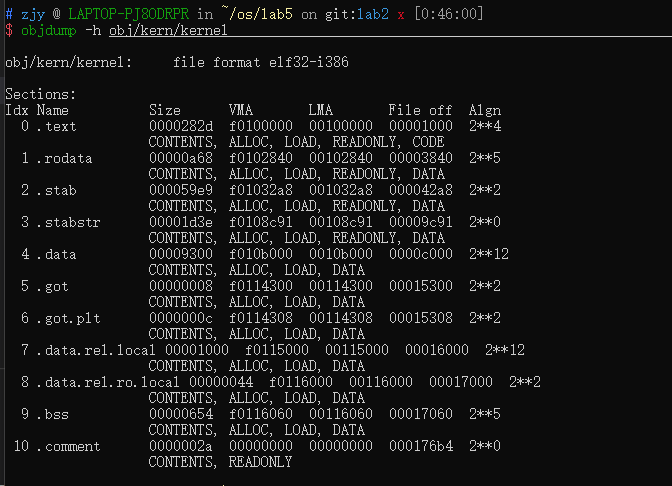

# ​<center>LAB5 内存管理实验报告</center>
## 任务一
### 代码实现
#### boot_alloc
​&emsp;&emsp;具体实现：
```c++
if(n==0)//n等于0，不做任何操作，返回未分配空间的首地址
	return nextfree;
result = nextfree;//否则返回申请空间的首地址
nextfree += ROUNDUP(n, PGSIZE);//将n与PGSIZE对齐，然后申请相应大小的地址空间
return result;
```
​&emsp;&emsp;该函数的作用为申请n个字节的地址空间，返回申请空间的首地址。
#### mem_init
​&emsp;&emsp;具体实现：
```c++
pages = (struct PageInfo *)boot_alloc(sizeof(struct PageInfo) * npages);
memset(pages, 0, sizeof(struct PageInfo) * npages);
```
​&emsp;&emsp;每一个物理页都对应一个`PageInfo`结构体，这个结构体中包含了两个信息：指向该页的指针数目和该物理页在空闲页列表中的下一个空闲页。此处需要利用`boot_alloc`函数为pages申请足够的空间，也就是物理页数目`npages`乘上`PageInfo`的大小。然后利用​`memset`函数将该空间中的所有数据设为0。
#### page_init
​&emsp;&emsp;具体实现：
```c++
size_t i;
pages[0].pp_ref = 1;//page 0设为正在使用
pages[0].pp_link = NULL;
for (i = 1; i < npages; i++){
	//IO hole[IOPHYSMEM, EXTPHYSMEM)设为正在使用，使其不会被分配
	if (i >= IOPHYSMEM / PGSIZE && i < EXTPHYSMEM / PGSIZE){
		pages[i].pp_ref = 1;
		pages[i].pp_link = NULL;
	}//从EXTPHYSMEM开始到未分配的空闲地址的首地址应设为正在使用
	//未分配的空闲地址的首地址由boot_alloc(0)获得
	else if (i >= EXTPHYSMEM / PGSIZE && i < PADDR(boot_alloc(0)) / PGSIZE){
		pages[i].pp_ref = 1;
		pages[i].pp_link = NULL;
	}else{
		pages[i].pp_ref = 0;
		pages[i].pp_link = page_free_list;
		page_free_list = &pages[i];
	}
}
```
​&emsp;&emsp;该函数就是初始化结构体`PageInfo`数组​`pages`，按照注释中的要求写即可。
#### page_alloc
​&emsp;&emsp;具体实现：
```c++
if(page_free_list == NULL)
	return NULL;//如果没有空闲页了则返回NULL
//否则将page_free_list向后移一位
struct PageInfo *p = page_free_list;
page_free_list = p->pp_link;
p->pp_link = NULL;//该物理页被分配了，所以pp_link设为NULL
//alloc_flags & ALLOC_ZERO为1，利用memset函数将该物理页用'\0'填满
if (alloc_flags & ALLOC_ZERO)
	memset(page2kva(p), '\0', PGSIZE);
return p;
```
​&emsp;&emsp;该函数用来分配一个物理页。其中`page2kva`函数将物理地址转换为虚拟地址。
#### page_free
​&emsp;&emsp;具体实现：
```c++
//需要被free的物理页的pp_ref应为0，pp_link应为NULL，如果不对，应该报错。
if (pp->pp_ref != 0 || pp->pp_link != NULL)
	panic("pp->pp_ref is nonzero or pp->pp_link is not NULL.");
//将物理页加到空闲页链表中
pp->pp_link = page_free_list;
page_free_list = pp;
```
​&emsp;&emsp;该函数用来释放一个物理页，也就是将物理页加到空闲页链表中，与page_alloc相反。
### 问题回答
#### 问题一
​&emsp;&emsp; **`mem_init`函数中`kern_pgdir`的虚拟地址和物理地址分别是多少？为什么我们在内存的页式管理机制实现前就可以使用虚拟地址映射？请找到对应的代码实现并详细写明原理。**
​&emsp;&emsp;查看`mem_init`函数代码：
```c++
kern_pgdir = (pde_t *) boot_alloc(PGSIZE);
memset(kern_pgdir, 0, PGSIZE);
```
​&emsp;&emsp;此处是第一次调用`boot_alloc`函数，第一次调用`boot_alloc`函数时`nextfree`会初始化为`end`符号的地址：
```c++
if (!nextfree) {
	extern char end[];
	nextfree = ROUNDUP((char *) end, PGSIZE);
}
```
​&emsp;&emsp;所以`kern_pgdir`的地址就是`end`与`PGSIZE`对齐后的地址，启动jos系统可以查看`end`的地址：
<div align=center></div>
​&emsp;&emsp;`end`的虚拟地址为`f01166a0`，物理地址为`001166a0`。与`PGSIZE`对齐后，`end`的虚拟地址为`f0117000`，物理地址为`00117000`，所以`kern_pgdir`的虚拟地址为`f0117000`，物理地址为`00117000`。
​&emsp;&emsp;答案在`entrypgdir.c`文件中：
```c++
__attribute__((__aligned__(PGSIZE)))
pde_t entry_pgdir[NPDENTRIES] = {
	// Map VA's [0, 4MB) to PA's [0, 4MB)
	[0]
		= ((uintptr_t)entry_pgtable - KERNBASE) + PTE_P,
	// Map VA's [KERNBASE, KERNBASE+4MB) to PA's [0, 4MB)
	[KERNBASE>>PDXSHIFT]
		= ((uintptr_t)entry_pgtable - KERNBASE) + PTE_P + PTE_W
};
```
​&emsp;&emsp;可以看到这里将虚拟地址[0, 4MB)和[KERNBASE, KERNBASE+4MB)均映射到了物理地址[0, 4MB)。所以在调用`mem_init`函数时物理内存的前4MB（0x400000）已经完成了内存映射，可以看到`kern_pgdir`的物理地址小于4MB，所以这里可以在内存的页式管理机制实现前就可以使用虚拟地址映射。

#### 问题二
​&emsp;&emsp;**在`page_init`函数中，`EXTPHYSMEM`之后的已经被使用的内存由哪些部分组成？请打印出对应部分起始的物理地址。**
​&emsp;&emsp;`EXTPHYSMEM`的地址为`0x100000`，利用`objdump -h`命令查看`obj/kern/kernel`文件的节：
​<div align=center></div>
​&emsp;&emsp;其中LMA就是各部分的起始地址。`.bss`段后就是`kern_pgdir`，这部分的起始地址为`0x117000`。

## 任务二
### 代码实现
#### pgdir_walk
​&emsp;&emsp;具体实现：
```c++
if (!(pgdir[PDX(va)] & PTE_P)){//如果页目录项不存在，则创建一个
	if (create == 0)//create=0，表示只查询，不做创建操作
		return NULL;//直接返回NULL
	//否则创建一个页表
	struct PageInfo *p = page_alloc(ALLOC_ZERO);
	if(p == NULL)//创建失败，返回NULL
		return NULL;
	p->pp_ref++;//指向页面p的指针加一
	//将va对应的页目录项设为页表p的物理地址，并设置权限位。
	pgdir[PDX(va)] = page2pa(p) | PTE_P | PTE_W | PTE_U;
}
//返回va对应的页表项地址
return (pte_t *)KADDR(PTE_ADDR(pgdir[PDX(va)])) + PTX(va);
```
​&emsp;&emsp;此函数的作用是给定线性地址`va`，返回va对应的页表项地址，其中储存着va对应的物理地址。其中`create`参数为0表示只查询，为1则需要在`va`对应页目录项为空时进行创建操作。其中有需要注意的函数或宏定义有：
1. `PDX(va)`：返回`va`对应的页目录索引。
2. `PTX(va)`：返回`va`对应的页表索引。
3. `pgdir[PDX(va)`：`va`所对应的页目录项，也就是`va`对应的页表的起始地址和劝限信息。
4. `PTE_ADDR(pgdir[PDX(va)])`：去除页目录项的权限信息，得到`va`对应的页表的起始地址。
5. `KADDR()`：将物理地址转换为虚拟地址。
#### boot_map_region
​&emsp;&emsp;具体实现：
```c++
//获取size所对应的页面数量，不足一个页面的部分应扩充为一个页面。
int n = ROUNDUP(size, PGSIZE) / PGSIZE;
for (int i = 0; i < n;i++){
	//得到va对应的页表项，没有则需创建
	pte_t *p = pgdir_walk(pgdir, (void *)va, 1);
	if (p == NULL)//创建失败，报错。
		panic("boot_mao_region:out of memory.\n");
	//将va对应的页表项设为pa，并设置权限位。
	*p = pa | PTE_P | perm;
	//更新pa、va到下一页。
	pa += PGSIZE;
	va += PGSIZE;
}
```
​&emsp;&emsp;此函数的作用为将虚拟地址`[va, va+size)`映射到物理地址`[pa, va+size)`。
#### page_insert
​&emsp;&emsp;具体实现：
```c++
//获取va对应的页表项，没有则创建
pte_t *p = pgdir_walk(pgdir, va, 1);
if (p == NULL)//创建失败返回-E_NO_MEM
	return -E_NO_MEM;
pp->pp_ref++;//指向页面pp的指针数加一
if ((*p) & PTE_P)
	//如果va对应的页表项存在有效
	//说明已有va所在页表已经被映射到一个物理页表
	//则清除va所在页表
	page_remove(pgdir, va);
//将va对应的页表项设置为pp的物理地址，并设置权限位
*p = page2pa(pp) | perm | PTE_P;
return 0;
```
​&emsp;&emsp;此函数的作用为往`va`对应的页表中插入一页，其实就是将`va`对应的虚拟页映射到物理页`pp`。
#### page_lookup
​&emsp;&emsp;具体实现：
```c++
//获取va对应的页表项，及va对应的物理页的起始地址和权限信息
pte_t* p = pgdir_walk(pgdir, va, 0);
if (p == NULL)//没有查到va对应的页表项，返回NULL
	return NULL;
if (!(*p) & PTE_P)//va对应的页表项无效，返回NULL
	return NULL;
//获取va对应的物理页
struct PageInfo *result = pa2page(PTE_ADDR(*p));
if (pte_store != NULL)//pte_store不为0
	*pte_store = p;//将va对应页表项保存到pte_store中
return result;
```
​&emsp;&emsp;此函数的作用为查询线性地址`va`对应的物理页。
#### page_remove
​&emsp;&emsp;具体实现：
```c++
pte_t *p;
//查询va对应的物理页，获取va对应页表项，保存到p中
struct PageInfo *pp = page_lookup(pgdir, va, &p);
if (pp == NULL)//查询失败，返回NULL
	return;
//调用page_decref函数
page_decref(pp);
*p = 0;//将va对应页表项置为0
//调用tlb_invalidate函数使va对应的TLB项失效
tlb_invalidate(pgdir, va);
```
`page_decref`函数
```c++
void page_decref(struct PageInfo* pp){
	if (--pp->pp_ref == 0)
	//将指向pp的指针数减一
	//如果没有任何指针指向pp了，释放物理页pp
		page_free(pp);
}
```
​&emsp;&emsp;此函数的作用为删除`va`与其对应物理页之间的映射，如果删除后指向该物理页的指针数为0，释放该页。此外还要使TLB表中`va`对应的项失效。
### 问题回答
#### 问题一
​&emsp;&emsp;**请你写出你实现的pgdir_walk中的变量有哪些是虚拟地址，哪些是物理地址，以及为什么是这样**
- `va`是线性地址，结构为一级页表索引+二级页表索引+物理页面偏移。
- `pgdir[PDX(va)]`为页目录项，保存的是`va`对应的页表的起始物理地址和权限信息。
- `pgdir`是页目录起始地址，是虚拟地址。
- 返回的页表项地址是虚拟地址。
​&emsp;&emsp;页目录项地址和页表项地址都是虚拟地址，因为这两个地址需要作为指针进行引用。
#### 问题二
​&emsp;&emsp;**page_insert注释中提到了一个和reinsert相关的corner case，请问是否有办法在不特殊处理的情况下巧妙规避掉这个corner case。**
​&emsp;&emsp;假设现在往相同的虚拟的地址重新插入相同的`pp`，如以下代码：
```c++
pp->pp_ref++;
if ((*p) & PTE_P)
	page_remove(pgdir, va);
```
​&emsp;&emsp;程序会检测到该虚拟地址已经映射到了一个物理页面，所以会调用`page_remove`函数删除该虚拟地址与`pp`之间的映射。值得注意的是，在调用`page_remove`函数之前会指向`pp`的指针的数加一，所以调用`page_remove`函数不会出现指向`pp`的指针的数减一后为0，然后释放物理页`pp`的情况。
#### 问题三
​&emsp;&emsp;**阅读参考资料3，阐述使用uvpt[PGNUM(va)]可以直接得到va对应的pte的原理**
​&emsp;&emsp;在`mem_init`函数中有这样一行代码：
```c++
kern_pgdir[PDX(UVPT)] = PADDR(kern_pgdir) | PTE_U | PTE_P;
```
​&emsp;&emsp;其中`UVPT`的值为`0xef400000`，这是一个线性地址，这句代码将`UVPT`对应的页目录项设为页目录的起始地址也就是`kern_pgdir`，而`uvpt[]`的起始地址就是`UVPT`。
​&emsp;&emsp;线性的地址的结构为：页目录索引（10bits）+页表索引（10bits）+物理页面偏移（12bits）。`UVPT`对应的就是`0x3bd+0x0+0x0`。现有一个线性地址`va：a+b+c`，其中`a、b、c`分别对应`va`的页目录索引、页表索引和物理页偏移。`PGNUM(va)`会使`va`右移12位，剩下的就是页目录索引+页表索引，即`a+b`，则`uvpt[PGNUM(va)]`的地址为`0x3bd+a+b`，我们可以将`0x3bd`看作页目录索引，`a`看作页表索引，`b`看作物理页偏移来寻址。这里需要注意的是，所谓的页目录本质上也是一个页表，所以以`0x3bd`为页目录索引找到的页表就是页目录本身，所以以`a`为页表索引找到的物理页其实是页目录索引为`a`的页表，以`b`为物理页偏移找到的数据其实就是页目录索引为`a`的页表中索引为`b`的页表项，也就是`va`对应的`pte`。
​&emsp;&emsp;**疑惑**：这里使用`PGNUM(va)`是有问题的，因为`b`只有10bits，而作为物理页偏移需要12bits，所以此处应该是`0x3bd+a+0x00+b`，即`uvpt[PDX(va)<<12+PTX(va)]`。
## 任务三
### 代码实现
​&emsp;&emsp;这里有三个部分的代码：
```c++
​boot_map_region(kern_pgdir, UPAGES, PTSIZE, PADDR(pages), PTE_U);
```
​&emsp;&emsp;`UPAGES`是`pages`的一个只读副本，大小为`PTSIZE`。权限为`PTE_U | PTE_P`，即用户和内核均只能读。注意`​boot_map_region`函数会自己设置`PTE_P`标志位，所以这里设置权限为`PTE_U `即可。
```c++
boot_map_region(kern_pgdir, KSTACKTOP - KSTKSIZE, KSTKSIZE, PADDR(bootstack), PTE_W);
```
​&emsp;&emsp;这里建立内核栈的虚拟地址和物理地址间的映射关系。其中`[KSTACKTOP-KSTKSIZE, KSTACKTOP)`由物理地址支持，需要建立映射；而`[KSTACKTOP-PTSIZE, KSTACKTOP-KSTKSIZE)`用来保护内核栈，不需要建立映射。这里的权限是内核可读可写，用户没有任何权限，即`PTE_W`。
```c++
boot_map_region(kern_pgdir, KERNBASE, 0xffffffff - KERNBASE, 0, PTE_W);
```
​&emsp;&emsp;这里需要将虚拟地址`[KERNBASE, 2^32)`映射到物理地址`[0, 2^32 - KERNBASE)`。权限和上一个部分一样是内核可读可写，用户没有任何权限，即`PTE_W`。
### 问题回答
#### question5
​&emsp;&emsp;`pages`数组最大为4MB，结构体`PageInfo`的大小为8bytes，则最多有4MB/8B=0.5M个物理页面。这些物理页面需要0.5M/1024=512个页表去管理，这部分需要512*4KB=2MB的内存。此外我们还需要4KB存放页目录，所以总共需要4MB+2MB+4KB，即6MB+4KB的内存去管理物理内存。
#### question6
​&emsp;&emsp;查看`entry.S`，在`jmp	*%eax`后，开始到`KERNBASE`之上运行。
```assembly
movl	$(RELOC(entry_pgdir)), %eax
movl	%eax, %cr3
# Turn on paging.
movl	%cr0, %eax
orl	$(CR0_PE|CR0_PG|CR0_WP), %eax
movl	%eax, %cr0

# Now paging is enabled, but we're still running at a low EIP
# (why is this okay?).  Jump up above KERNBASE before entering
# C code.
mov	$relocated, %eax
jmp	*%eax
```
​&emsp;&emsp;查看函数`entry_pgdir`：
```c++
// Map VA's [0, 4MB) to PA's [0, 4MB)
[0]
	= ((uintptr_t)entry_pgtable - KERNBASE) + PTE_P,
// Map VA's [KERNBASE, KERNBASE+4MB) to PA's [0, 4MB)
[KERNBASE>>PDXSHIFT]
	= ((uintptr_t)entry_pgtable - KERNBASE) + PTE_P + PTE_W
```
​&emsp;&emsp;可以看到这里将虚拟地址`[0, 4MB)`和`[KERNBASE, KERNBASE+4MB)`都映射到了物理地址`[0, 4MB)`。所以只要`eip`的地址小于4MB，就能通过虚拟地址映射到正确的物理地址，因此此时能在低地址`eip`运行。
## 任务四
### 相同点
1. 两者的线性地址结构相同，均是10位的页目录索引+10位的页表索引+12位的物理页偏移。
2. 两者一页的大小均为4KB，一个页表的大小也均为4KB，包含1024个页表项，页目录项和页表项中也均含有权限标记位。
3. 内核代码、数据的虚拟地址均位于高地址，即都在各自的`KERNBASE`之上。
4. 两者对于物理页的分配和释放都由内核完成，用户只需要针对虚拟地址进行管理即可。
5. 未分配的内存两者均会放到一个链表中管理。
6. 每个进程都有自己单独的页表。
### 不同点
1. xv6管理空闲页面的链表中没有用来表示指向该页面的指针数量的变量，系统在释放虚拟页面时会直接释放对应的物理页面。
2. xv6利用一个`kmap`的结构体来设置内存权限：
```c++
static struct kmap {
  void *virt;
  uint phys_start;
  uint phys_end;
  int perm;
} kmap[] = {
 { (void*)KERNBASE, 0,             EXTMEM,    PTE_W}, // I/O space
 { (void*)KERNLINK, V2P(KERNLINK), V2P(data), 0},     // kern text+rodata
 { (void*)data,     V2P(data),     PHYSTOP,   PTE_W}, // kern data+memory
 { (void*)DEVSPACE, DEVSPACE,      0,         PTE_W}, // more devices
};
```
3. xv6释放和分配页面不是一个页面一个页面地分配和释放，而是利用`oldsz`和`newsz`两个参数来控制分配和释放的空间大小。
4. jos的`KERNBASE`是`0xf0000000`，xv6是`0x80000000`。